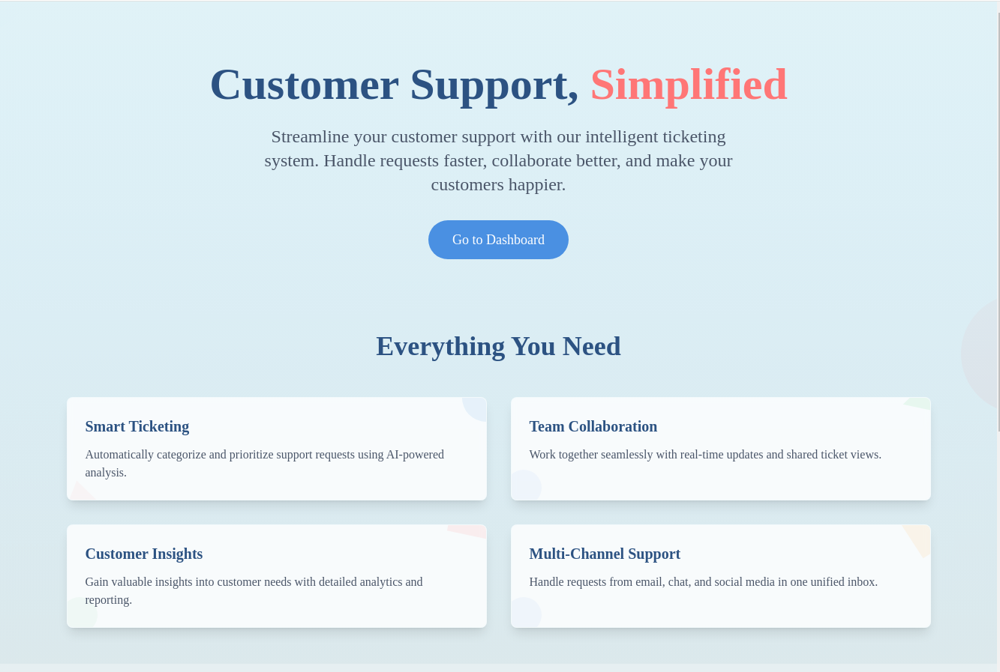
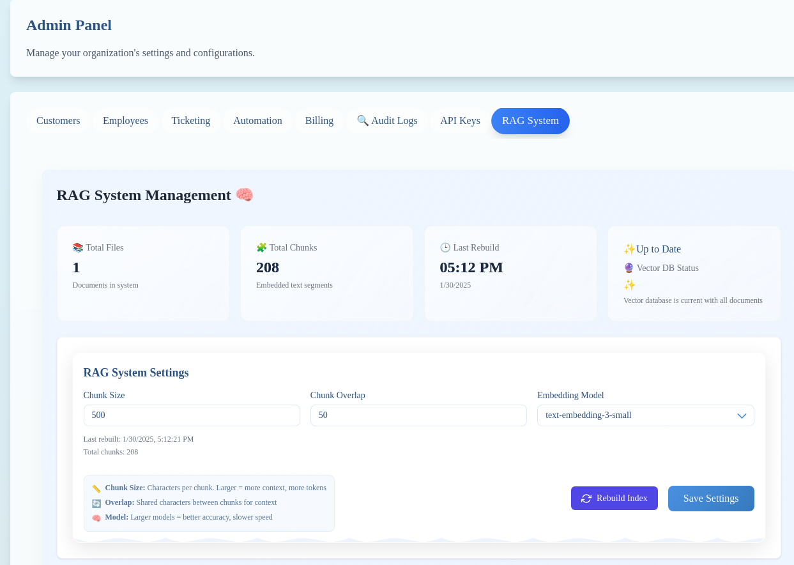
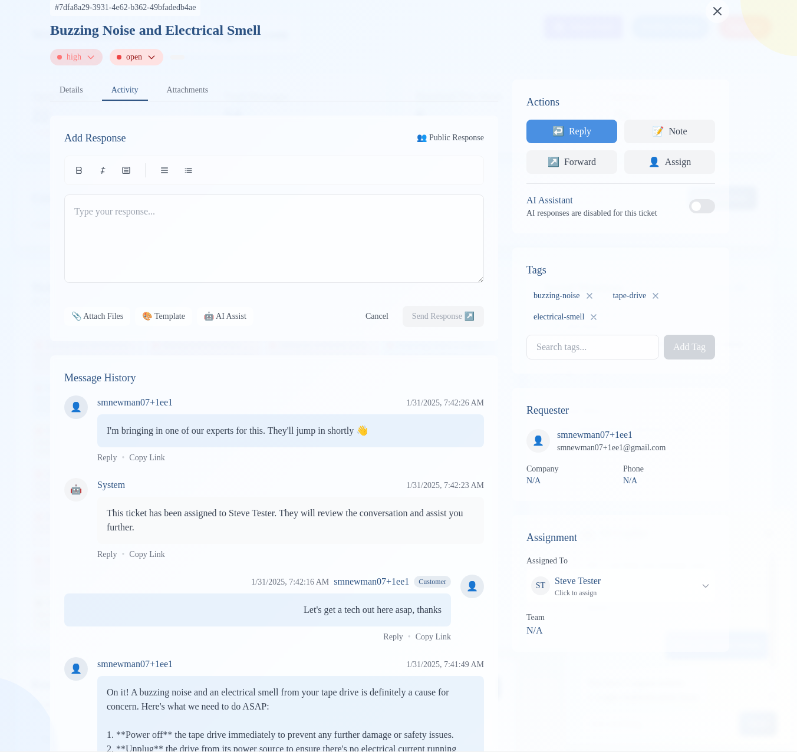
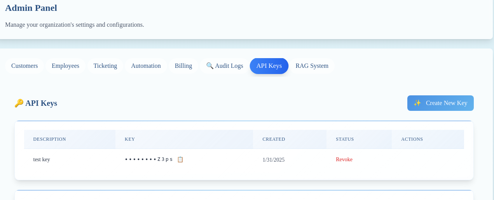

# Breeze.help AI-first help desk tool


## Features

- Ticketing
- Ticket feed heatmap
- Admin and employee users
- real time ticket updates
- manage tickets, assignees, status, priority, tags, etc
- customer portal with chat
- Audit logs
- send email notifications via resend
- User authentication (signup, login, logout)
- Modern, responsive UI with ocean-inspired design
- Real-time database connection status
- 3 ticketing feed views to give you a birds eye view
- RAG document storage/retrieval
- Multi Agent system
- AI ticket classification
- AI ticket triage
- AI ticket resolution
- AI ticket prioritization
- AI ticket assignment
- tracking with custom tags in langsmith
- toggle AI agents for any ticket


## Screenshots


*Modern, ocean-inspired landing page with seamless authentication*


*Comprehensive company dashboard with real-time ticket analytics and team management*


*Smart ticket feed with AI classification, prioritization, and assignment*


*Live metrics dashboard showing ticket resolution rates and team performance*


*Full-featured ticketing panel with AI assistance and RAG system integration*


*API key management interface for secure third-party integrations*


## Tech Stack

- Next.js 14
- TypeScript
- Supabase (Authentication & Database)
- Tailwind CSS
- Docker

## Local Development Setup

### Docker Setup

1. Install Docker and Docker Compose on your system:
   - [Docker Desktop](https://www.docker.com/products/docker-desktop/) (Windows/Mac)
   - For Linux:
     ```bash
     curl -fsSL https://get.docker.com -o get-docker.sh
     sudo sh get-docker.sh
     ```

2. Verify Docker installation:
   ```bash
   docker --version
   docker compose --version
   ```

### Supabase Setup

1. Install Supabase CLI:
   ```bash
   npm install -g supabase
   ```

2. Start Supabase locally:
   ```bash
   cd supabase
   supabase start
   ```
   This will start all necessary Supabase services in Docker containers.

3. The CLI will output your local Supabase credentials. Save these for your environment variables:
   - Supabase URL (typically `http://localhost:54321`)
   - Supabase Anon Key
   - Supabase Service Role Key (for admin tasks)

4. Apply database migrations:
   ```bash
   supabase migration up
   ```

5. To stop Supabase services:
   ```bash
   supabase stop
   ```

## Getting Started

1. Clone the repository and switch to the main branch:
```bash
git clone https://github.com/newman8r/c-breeze.git
cd c-breeze
git checkout main
```

2. Install dependencies:
```bash
npm install
```

3. Set up environment variables:
Create a `.env.local` file in the frontend directory with the following variables:
```
NEXT_PUBLIC_SUPABASE_URL=your_supabase_url
NEXT_PUBLIC_SUPABASE_ANON_KEY=your_supabase_anon_key
```

4. Run the development server:
```bash
npm run dev
```

Open [http://localhost:3000](http://localhost:3000) with your browser to see the result.

## Development Workflow

### Working with Supabase

1. Make database changes:
   ```bash
   supabase migration new your_migration_name
   ```
   This creates a new migration file in `supabase/migrations/`.

2. Edit the migration file with your SQL changes.

3. Apply the migration:
   ```bash
   supabase migration up
   ```

4. To reset the database:
   ```bash
   supabase db reset
   ```

### Docker Commands

- Build and start all services:
  ```bash
  docker compose up -d
  ```

- View logs:
  ```bash
  docker compose logs -f
  ```

- Stop all services:
  ```bash
  docker compose down
  ```

## Deployment

### AWS Amplify Setup

1. Install and configure AWS CLI with your credentials:
   ```bash
   aws configure
   ```
   Use the profile name 'gauntlet' when prompted.

2. Install the Amplify CLI:
   ```bash
   npm install -g @aws-amplify/cli
   ```

3. Configure Amplify:
   ```bash
   amplify configure
   ```

### Setting Up Production Environment

1. Copy the template script:
   ```bash
   cd frontend/scripts
   cp set-amplify-env.template.sh set-amplify-env.sh
   chmod +x set-amplify-env.sh
   ```

2. Edit `set-amplify-env.sh` with your production values:
   - Replace `your_app_id` with your Amplify app ID
   - Set your production Supabase URL and anon key

3. Set up production environment variables:
   ```bash
   ./set-amplify-env.sh
   ```

### Deploying to Amplify

1. Initial setup (if not already done):
   ```bash
   cd frontend
   amplify init
   ```

2. Deploy your application:
   ```bash
   amplify push
   ```

3. Monitor your deployment:
   - Visit the AWS Amplify Console
   - Select your app
   - View the deployment status and logs

### Supabase Production Deployment

1. Log in to Supabase:
   ```bash
   supabase login
   ```

2. Link your local project to your Supabase production project:
   ```bash
   cd supabase
   supabase link --project-ref your-project-ref
   ```
   Find your project ref in your Supabase dashboard project settings.

3. Deploy database changes:
   ```bash
   supabase db push
   ```
   This will apply all migrations to your production database.

4. Get production credentials:
   - Go to your Supabase project dashboard
   - Navigate to Project Settings > API
   - Copy the following credentials:
     - Project URL
     - `anon` public API key
     - `service_role` key (for admin tasks only)

5. Set up production environment:
   - Add these credentials to your AWS Amplify environment variables

6. Database Backups:
   - Enable automated backups in Supabase dashboard
   - Set up a backup schedule
   - Test backup restoration process
   - Store backup files securely

7. Monitoring Production Database:
   - Set up database alerts in Supabase dashboard
   - Monitor database performance
   - Set up error tracking
   - Watch for unusual usage patterns

8. Security Considerations:
   - Enable Row Level Security (RLS)
   - Review and test all security policies
   - Limit service_role key usage
   - Regularly rotate API keys
   - Enable SSL enforcement

### Production Considerations

1. Environment Variables:
   - Ensure all required environment variables are set in the Amplify Console
   - Double-check that you're using production Supabase credentials
   - Never commit production credentials to the repository

2. Database Migrations:
   - Apply migrations to your production Supabase instance before deploying
   - Test migrations locally first
   - Back up production data before applying migrations

3. Monitoring:
   - Set up AWS CloudWatch alerts for your Amplify app
   - Monitor Supabase usage and performance
   - Set up error tracking (recommended: Sentry or similar)

## Contributing

Pull requests are welcome. For major changes, please open an issue first to discuss what you would like to change.

## License

[MIT](https://choosealicense.com/licenses/mit/)
